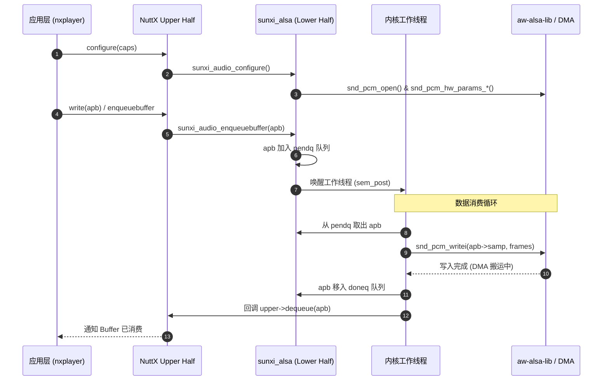

# OpenVela (R528) Audio 驱动设计与实现流程指南

本指南基于 OpenVela 官方《Audio 驱动设计与实现流程文档》（润芯微智能科技），深入解析位于 `vendor/allwinnertech/chips/r528/components/audio` 目录下的音频驱动实现细节，涵盖 NuttX 音频分层架构、`aw-alsa-lib` 适配层、Buffer 队列生命周期、IoCtl 控制及底层调试避坑要点。

---

## 1. 总体架构设计与分层模型

OpenVela 在全志 R528-S3 平台上遵循 NuttX 标准的 **"Upper-Half" + "Lower-Half"** 驱动模型，同时引入全志专有的中间件层进行解耦：

```mermaid
graph TD
    UserApp[用户应用 (nxplayer / nxrecorder / voice_pipeline)] --> Upper[NuttX Audio Upper Half (/dev/audio/pcm*)]
    Upper --> Lower[sunxi_alsa.c (Lower Half 驱动)]
    Lower --> ALSALib[aw-alsa-lib (PCM / Control API)]
    ALSALib --> HAL[R528 HAL (Codec / I2S / DMA 控制器)]
    HAL --> HW[音频硬件 (MIC / DAC / 功放 PA / 喇叭)]
```

### 1.1 分层职责划分

| 层次 | 对应代码与路径 | 核心职责 |
| :--- | :--- | :--- |
| **Upper Half (内核标准层)** | `nuttx/drivers/audio/audio.c` | 提供字符设备接口（`/dev/audio/pcm0p`、`/dev/audio/pcm0c`），管理 `apb` (Audio Pipeline Buffer) 队列及用户态交互。 |
| **Lower Half (芯片驱动层)** | `vendor/.../audio/sunxi_alsa.c` | 实现 NuttX `struct audio_lowerhalf_s` 接口，桥接 NuttX Audio 子系统与全志 `aw-alsa-lib`，负责设备初始化、参数配置、Buffer 入队/出队、音量与 EQ 控制。 |
| **HAL/Middleware (全志中间件)** | `aw-alsa-lib` (`pcm.h`, `control.h`) | 提供类 ALSA 接口封装，屏蔽底层的物理寄存器与 DMA 传输细节。 |
| **硬件层 (Hardware)** | R528 SoC 内部 Codec / I2S / DMA | 物理音频采集与回放通路。 |

---

## 2. 核心数据结构 (`sunxi_alsa.c`)

驱动的核心运行态由 `struct sunxi_dev_s` 结构体统一维护，它继承并扩展了 NuttX 的 `struct audio_lowerhalf_s`：

```c
struct sunxi_dev_s
{
  struct audio_lowerhalf_s dev;         /* 标准 NuttX Lower Half 接口 */
  struct dq_queue_s        pendq;       /* 等待处理的 Buffer 队列 (Pending Queue) */
  struct dq_queue_s        doneq;       /* 处理完成的 Buffer 队列 (Done Queue) */

  /* aw-alsa-lib 句柄 */
  snd_pcm_t               *pcm;         /* PCM 设备句柄 (Playback/Capture) */

  /* 运行状态与同步控制 */
  bool                     running;     /* 是否正在运行传输 */
  bool                     paused;      /* 是否处于暂停状态 */
  sem_t                    pendsem;     /* 保护 Pending 队列与唤醒工作线程的信号量 */

  /* 音频参数缓存 */
  uint32_t                 sample_rate; /* 采样率 (如 16000, 44100, 48000) */
  uint8_t                  channels;    /* 通道数 (1: Mono, 2: Stereo) */
  uint8_t                  bps;         /* 采样位深 (Bits Per Sample, 如 16) */

  /* 硬件资源配置 */
  const char              *card_name;   /* 声卡名称 (如 "audiocodec", "snddaudio0") */
  int                      stream_type; /* 流类型: SND_PCM_STREAM_PLAYBACK 或 CAPTURE */
};
```

---

## 3. 核心执行流程与实现时序

### 3.1 初始化流程 (`sunxi_driver_audio_initialize`)

驱动入口通常在系统板级初始化阶段（如 `board_app_initialize`）被调用：

1. **分配私有数据结构**：为 `struct sunxi_dev_s` 分配堆内存并清零。
2. **绑定操作函数表**：
   ```c
   priv->dev.ops = &g_audioops;
   ```
   其中 `g_audioops` 实现了 `getcaps`、`configure`、`enqueuebuffer`、`start`、`stop`、`pause`、`resume`、`ioctl` 等虚函数。
3. **初始化队列与同步信号量**：
   - 调用 `dq_init(&priv->pendq)` 与 `dq_init(&priv->doneq)`。
   - 调用 `nxsem_init(&priv->pendsem, 0, 0)`。
4. **配置声卡默认参数**：设置默认声卡名称（如 `"audiocodec"`）以及流方向（Playback 或 Capture）。
5. **注册到 Upper Half**：调用 `audio_register("pcm0p", &priv->dev)`，在 `/dev/audio/` 下生成字符设备节点。

---

### 3.2 播放流程 (Playback)

当应用层（如 `nxplayer` 或应用代码）播放音频时，数据流转时序如下：



1. **配置 (`configure`)**：
   - 上层调用 `sunxi_audio_configure`，驱动解析 `caps` 参数，更新采样率、声道与位深。
   - 调用 `snd_pcm_open` 打开 PCM 句柄，并通过 `snd_pcm_hw_params_*` 接口配置底层硬件。
2. **入队 (`enqueuebuffer`)**：
   - 上层填充音频数据后，将 `apb` (Audio Pipeline Buffer) 传入 `sunxi_audio_enqueuebuffer`。
   - 驱动将 Buffer 加入 `pendq` 队列。如果 PCM 尚未启动，则触发 `sunxi_audio_start`。
3. **启动与传输 (`start` & Worker Thread)**：
   - 启动内核工作线程，调用 `snd_pcm_prepare` 和 `snd_pcm_start`。
   - 工作线程循环从 `pendq` 取出 Buffer，调用 `snd_pcm_writei` 将数据送入 DMA/FIFO。
4. **出队通知 (`dequeue`)**：
   - 写入完成后，Buffer 转移至 `doneq`，并通过 `upper->dequeue` 回调向上层返还 Buffer，完成闭环。

---

### 3.3 录音流程 (Capture)

录音流程与播放对称，但数据流向相反：

1. **配置参数**：调用 `configure` 设置录音采样率（通常为 16kHz）、声道（单声道/双声道）和位深（16-bit）。
2. **分配空 Buffer**：上层预先分配空的 `apb` 并通过 `enqueuebuffer` 压入 `pendq`。
3. **读取硬件数据**：工作线程检测到空闲 Buffer，调用 `snd_pcm_readi` 从底层硬件读取 PCM 样本填入 Buffer。
4. **回调消费**：填满后将 Buffer 移入 `doneq`，通过回调通知上层读取和处理数据。

---

### 3.4 控制流程 (IoCtl & Mixer)

驱动通过 `sunxi_audio_ioctl` 响应控制命令：

* **音量控制 (`AUDIOIOC_SETVOLUME`)**：
  - 映射到 `sunxi_audio_setvolume`。
  - 调用 `snd_ctl_*` 系列接口调节 Codec 内部模拟/数字增益（Gain）。
* **EQ 均衡器配置**：
  - 驱动内置 EQ 配置文件加载逻辑（如读取 `/etc/EQ_ACM.conf`）。
  - 通过私有 IOCTL 或初始化时将 DSP 参数写入硬件寄存器。
* **暂停与恢复 (`AUDIOIOC_PAUSE` / `AUDIOIOC_RESUME`)**：
  - 映射到底层 `snd_pcm_pause`，挂起或恢复 DMA 传输。

---

## 4. 关键函数解析

### 4.1 `sunxi_audio_getcaps`
* **功能**：查询底层设备支持的能力集（音频格式、采样率范围、通道数）。
* **实现**：根据请求类型 `caps->ac_type` 返回能力掩码：
  - `AUDIO_TYPE_QUERY`：返回驱动支持的格式能力（如 PCM、MP3 解码等）；
  - `AUDIO_TYPE_OUTPUT` / `INPUT`：返回支持的采样率（8k~192k）和通道位图。

### 4.2 `sunxi_audio_configure`
* **功能**：运行时参数重配置（最复杂的核心配置函数）。
* **时机**：在设备初次打开或切换歌曲、改变采样率时调用。
* **处理逻辑**：若硬件已经打开处于运行态，需先调用 `snd_pcm_close` 关闭旧流，再用新参数重新 `open` 并初始化硬件参数。

### 4.3 `sunxi_audio_shutdown`
* **功能**：关闭设备并释放资源。
* **处理逻辑**：停止工作线程，清理 `pendq` 与 `doneq` 中的残留 Buffer，调用 `snd_pcm_close` 释放 ALSA 句柄与 DMA 通道。

---

## 5. 注意事项与底层调试排坑

### 5.1 Buffer 大小与 DMA 匹配
* **问题**：应用层配置的 Buffer 大小若未与底层的 DMA 突发传输长度（Burst Length）或 FIFO 深度对齐，极易引发欠载（Underrun，爆音/断音）或溢出（Overrun，丢帧）。
* **规范**：推荐单次 Buffer 长度为底层周期大小（Period Size）的整倍数（如 16kHz 16-bit 单声道推荐 640 字节 / 20ms）。

### 5.2 EQ 配置文件依赖
* **问题**：驱动启动时会尝试加载 `/etc/EQ_ACM.conf` 等音效配置文件。
* **现象**：若文件缺失，EQ 初始化会降级跳过。虽然不影响发声，但会导致扬声器频响曲线未校正、音质发闷或高频失真。排查时应确认根文件系统中是否存在对应的 EQ 配置文件。

### 5.3 电源管理与功放爆破音 (Pop-Noise)
* **原理**：系统进入休眠或音频流停止时，必须遵循严格的时序关闭外部功放 PA（Power Amplifier），唤醒后再开启 PA。
* **规范**：在 PM 挂起回调中先静音 Codec 并拉低 PA 使能引脚；在恢复流程中延时等待 Codec 电平稳定后再打开 PA，避免瞬间直流偏移产生刺耳爆破音。

### 5.4 驱动调试宏开关
在开发与调试阶段，可在 Kconfig 中开启：
```kconfig
CONFIG_AUDIO_DRIVER_DEBUG=y
```
开启后，`sunxi_alsa.c` 会输出详细的 Buffer 流转日志、DMA 状态及采样点计数，便于定位上层与驱动层的同步卡死问题。
