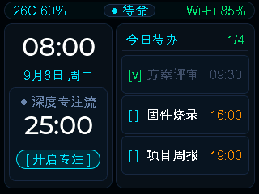
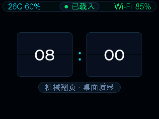
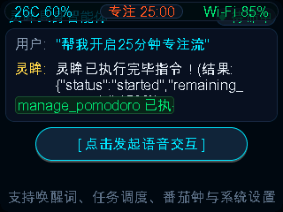
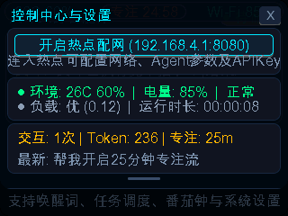

# 🌟 Phoenix HoloDesk-S1 | 桌面具身数字生命体与环境外脑
### *Gemini-S1 Cyber-Familiar & Ambient Brain on OpenVela RTOS*

<div align="center">

[-blue?style=for-the-badge&logo=linux)](https://openvela.com)
[-orange?style=for-the-badge)](https://openvela.com)
[](https://deepseek.com)
[](https://lvgl.io)
[]()
[]()

**2026 首届 OpenVela AI 硬件开发者大赛 · AI 硬件产品创新赛道 参赛作品**  
**队伍编号**：`contest2026_145` ｜ **参赛队名**：**花儿那样红** (huaernayanghong)

[🌟 产品设计方案](Doc/产品设计.md) · [📱 ADB 实战调试指南](Doc/ADB_DEBUGGING_GUIDE.md) · [🧠 Agent 源码架构](app/phoenix_agent_app/README.md) · [🌐 Web 伴侣控制台](web/)

</div>

---

## 📸 界面视效与多模态交互一览

| 1. 主舞台·桌面使魔 (Stage) | 2. 拟物翻页钟与微气象 | 3. 灵眸 Agent 交互与功德木鱼 | 4. 顶部下拉控制中心 (Drawer) |
| :---: | :---: | :---: | :---: |
|  |  |  |  |
| **Living Cyber-Eye 微动生命感** | **机械拟真打簧与网络天气拟态** | **ReAct 思考气泡与赛博解压** | **实时 IP 遥测、Web 与外设管控** |

---

## 一、作品简介 (Project Overview)

**Phoenix HoloDesk-S1** 是一款常驻极客桌面、基于 **OpenVela 嵌入式实时操作系统** 与 **润芯微 Gemini-S1（全志 R528-S3 双核 Cortex-A7 @ 1.2GHz + 128MB DDR3 + HiFi4 DSP）** 硬件深度定制的**物理容器式桌面具身数字生命体与环境外脑**（Ambient Cyber-Familiar & Personal Second Brain）。

我们坚信具身智能不应局限于机械玩具或单调的文字气泡，而是应当遵循核心设计哲学：
> **「硬件是躯壳（Hardware Vessel），卡带是心智（Agent Cartridge），网络是纽带（Companion Link）。」**

### 💡 核心痛点与突破创新
- 🎯 **告别单调指令机械交互**：引入 **Living Cyber-Eye（赛博灵眸微表情系统）**，基于 LVGL 9 矢量抗锯齿与微动插值算法，拥有自主眨眼、眼动巡航、暗光睡眠与 6 色情绪光环，赋予硬件有温度的呼吸感；
- 🧠 **端云协同的 ReAct 具身心智闭环**：端侧搭载轻量级 **ReAct (Reasoning + Acting)** 思考状态机，深度整合 DeepSeek 大模型流式思维链与声明式 Tool Calling，无需人工干预即可自主感知、推理、调度硬件外设并执行动作；
- ⚡ **完备的硬件抽象与双端解耦 (HAL Architecture)**：设计标准化驱动虚表（Sensor / Actuator / System），同时提供板载真机驱动与宿主机全保真仿真驱动，**支持在 PC 终端 0.2 秒完成 14 项全链路单元测试与自动化验证**；
- 🌐 **双模网络与极客 Web 看板**：支持 SoftAP 强制门户（Captive Portal）与 BLE 蓝牙低功耗秒级配网；设备内嵌轻量 HTTP Web 服务，局域网终端访问即可呈现现代化的 **ReAct Agent Studio 看板**（支持思考胶囊、流式时间线与模态工具执行器）。

---

## 二、选题方向 (Contest Track)

* **参赛赛道**：**AI 硬件产品创新 (AI Hardware Product Innovation)**
* **选题理由**：
  1. **充分释放 OpenVela RTOS 与多核异构硬件效能**：OpenVela 在全志 R528-S3 平台上兼具高实时性、轻量内存占用与 POSIX 兼容生态。我们利用其 uORB 传感总线、VFS 文件驱动与网络栈，构建了工业级稳定性的嵌入式 Agent 基座；
  2. **探索大模型在端侧物理外设的真实落地**：将大模型能力从“屏幕里的聊天框”解放为“能听（音频拾音 VAD）、能看（环境感应/微表情）、能动（敲击感应/马达震动/LED 呼吸/应用拉起）”的案头具身智能体；
  3. **软硬件全栈工程化度极高**：具备完整的卡带插件热轮换机制、双模配网容灾流转、多通道分流黑匣子日志排障以及完备的自动化测试体系。

---

## 三、系统架构与技术全景

Phoenix HoloDesk-S1 整体遵循高内聚、低耦合的分层架构体系，各层职责边界清晰：

```mermaid
graph TD
    subgraph 🖥️ UI & Interaction Layer (LVGL 9 @ 60fps)
        UI_Stage[舞台视窗 Stage<br>卡带全屏渲染] --- UI_Drawer[顶部下拉抽屉 Drawer<br>系统控制中心]
        UI_Capsule[顶部微胶囊 Capsule<br>状态感知流转] --- EyeAnim[灵眸矢量渲染引擎<br>Living Cyber-Eye]
    end

    subgraph 🧠 Core & Mind Engine Layer
        AgentCore[ReAct 心智引擎<br>Reasoning + Acting] --> EventBus[轻量级发布-订阅<br>事件总线 EventBus]
        CartridgeMgr[卡带调度管理器<br>萌宠/灵感/翻页钟/木鱼] --> EventBus
        ToolRegistry[声明式工具注册中心<br>Tool Calling Registry] --> AgentCore
        WebPortal[内嵌 Web Portal<br>REST API / 静态资源] --> AgentCore
    end

    subgraph 🌐 Harness & Model Adapter Layer
        LLMProvider[LLM Provider 调度门面]
        LLMProvider --> LLM_Cloud[DeepSeek / MiMo 云端流式驱动]
        LLMProvider --> LLM_Mock[宿主机仿真规则引擎]
        VoicePipe[音频与语音流水线: PCM 采集 -> VAD -> ASR -> TTS]
    end

    subgraph ⚡ HAL 硬件抽象层 (双端解耦)
        HALMgr[HAL Manager 管理中枢]
        HAL_Sensor[传感器接口: 敲击/光敏/电池]
        HAL_Actuator[执行器接口: 音频PCM/马达/LED]
        HAL_System[系统接口: 遥测/原生应用拉起]
        HALMgr --> HAL_Driver_Vela[全志 R528-S3 真实硬件驱动]
        HALMgr --> HAL_Driver_Mock[PC 宿主机全保真注入驱动]
    end

    subgraph 📦 OpenVela OS & Allwinner R528-S3 Platform
        NuttX_Kernel[OpenVela NuttX RTOS 内核]
        Hardware[双核 A7 1.2GHz + 128MB DDR3 + HiFi4 DSP + RTL8723FS Wi-Fi/BT]
    end

    UI_Stage --> EventBus
    EventBus --> AgentCore
    AgentCore --> ToolRegistry
    ToolRegistry --> HALMgr
    AgentCore --> LLMProvider
    VoicePipe --> HAL_Actuator
    HALMgr --> NuttX_Kernel
```

### 🛠️ 具身 Tool Calling 外设工具生态矩阵

| 工具标识 (Tool Name) | 关联外设 / 驱动 | 具身功能与行为效果 |
| :--- | :--- | :--- |
| `knock_wooden_fish` | 触觉振动马达 + 音频 PCM + 持久化 | 触发木鱼清脆敲击音效、触觉钝击反馈，积攒赛博功德，屏幕呈现飞字动效 |
| `manage_pomodoro` | 定时器 + 顶部微胶囊 + 蜂鸣提示 | 开启/停止 25 分钟沉浸专注番茄钟，胶囊实时倒计时，到期双脉冲震动 |
| `set_eye_emotion` | LVGL 矢量光环 + 灵眸瞳孔 | 大模型根据情绪意图自主切换 6 大微表情与光环（待命/倾听/思考/开心/警戒/困倦） |
| `query_system_health` | HAL 真实动态遥测 (procfs/mallinfo) | 巡检 CPU 占用、内存堆剩余、开机时长、Wi-Fi RSSI 及核心传感器在线状态 |
| `tool_environment` | IIO 温湿度传感器 + 光照 ALS | 采集案头环境温湿度与光照，光线暗时大模型主动触发灵眸伴睡模式 |
| `tool_todo` | 本地闪存存储 + Web 看板联动 | 语音或交互记录待办事项与闪念灵感，自动同步至局域网 Web 看板 |
| `tool_blink_led` | 全志 R528 GPIO 板载 SYS_LED | 自主控制开发板物理指示灯闪烁频率与工作状态，实现物理级心跳告警 |
| `tool_launch_app` | POSIX `posix_spawn` / 系统服务 | 通过具身决策拉起快应用或系统底层后台应用服务 |

---

## 四、项目目录结构说明

```text
contest2026_145_huaernayanghong/
├── app/                                    # 📱 核心作品代码
│   └── phoenix_agent_app/                  # Phoenix HoloDesk-S1 具身智能体应用
│       ├── core/                           #   心智核心: ReAct 引擎、事件总线、Web 路由、存储
│       ├── hal/                            #   硬件抽象层: 传感器/执行器/系统服务统一 VTable
│       │   └── drivers/                    #     板载真实驱动 (R528-S3) 与宿主机 Mock 驱动
│       ├── harness/                        #   大模型适配层: DeepSeek 云端驱动、仿真后端、语音管线
│       ├── tools/                          #   具身 Tool Calling 工具集 (木鱼/番茄钟/LED/遥测等)
│       ├── ui/                             #   LVGL 9 三层视窗交互、灵眸微表情矢量引擎、中文字库
│       ├── perception/                     #   物理感知引擎: 敲击感应防抖与高层事件融合
│       ├── utils/                          #   四重多通道并发分流日志、环形缓冲区、时间同步
│       ├── test/                           #   全保真测试套件 (含 host_runner、一键测试脚本)
│       ├── CMakeLists.txt / Makefile       #   构建配置文件
│       └── Kconfig                         #   内核与组件配置选项
├── web/                                    # 🌐 局域网 Web 伴侣控制台 (React + Vite + Vanilla CSS)
│   ├── src/                                #   ReAct Agent Studio 现代化看板源码
│   ├── ble_setup.html                      #   Web Bluetooth 网页端低功耗蓝牙极速配网页面
│   ├── setup.html                          #   SoftAP 极简配网门户 (Captive Portal)
│   ├── dashboard.html                      #   嵌入式单文件离线备用控制看板
│   └── sync_assets.py                      #   前端静态资源压缩打包转 C 语言头文件工具
├── hello_quickapp/                         # ⚡ 快应用示例代码 (OpenVela QuickApp 生态联动)
│   ├── manifest.json                       #   快应用清单配置
│   └── src/pages/index/index.ux            #   快应用页面交互逻辑
├── board/                                  # 🔌 板级配置与硬件适配扩展目录
├── Doc/                                    # 📚 深度技术设计文档与实战测试手册
│   ├── 产品设计.md                         #   系统级产品设计规格书、卡带矩阵与交互哲学
│   ├── ADB_DEBUGGING_GUIDE.md              #   400+ 行 ADB 全功能调试与硬件测试命令集手册
│   └── CONTEST_README_TEMPLATE.md          #   大赛原始说明模版归档
├── scripts/                                # 🛠️ 宿主机辅助与 ADB 实时排障诊断工具
│   ├── adb_live_log.py                     #   彩色实时 ADB 日志分流过滤监视器
│   ├── test_board_bluetooth.py             #   蓝牙与 BLE 配网全自动化诊断脚本
│   └── monitor_dmesg.py                    #   内核崩溃与 dmesg 异动捕获工具
├── logs/                                   # 🤖 AI Coding 协作对话日志归集目录 (见 logs/README.md)
└── contest2026_145_huaernayanghong.xml     # 📜 Repo 编译清单 Manifest 文件 (软链映射)
```

---

## 五、运行与复现指南

为了方便大赛评审专家全面、快速地验收复现本项目，我们提供了**「0.2秒宿主机免硬件极速验证」**与**「全志 R528-S3 实机固件构建烧录」**两种体验路径。

### 🚀 路径 1：0.2 秒宿主机免硬件快速体验 (推荐评审首选)

本项目具备高度完备的硬件抽象与仿真驱动，无需物理硬件即可在 Linux / macOS 终端极速完成编译与 14 大全保真测试用例验证：

```bash
# 1. 进入测试目录
cd app/phoenix_agent_app/test

# 2. 一键编译并执行全套测试与 REPL 交互
./run_host_test.sh
```

**运行效果**：
- ⚡ **0.2 秒** 内自动化运行 14 大核心模块单测（HAL 注册、传感器事件注入、ReAct 循环、Tool Calling 派发、事件总线发布订阅、矢量眼睛动效等），测试通过率 **100%**；
- 🖥️ 自动进入内置 **交互式 REPL 终端**，支持直接键入命令手动体验：
  ```text
  phoenix> help                          # 查看所有支持的测试与调度指令
  phoenix> knock                         # 注入物理轻敲 -> 自动触发赛博木鱼功德+1
  phoenix> ask "现在几点了，启动番茄钟"    # 触发 ReAct 意图解析与 Tool Calling
  phoenix> health                        # 查看宿主机系统指标动态遥测
  phoenix> exit                          # 退出
  ```

---

### 🔨 路径 2：OpenVela 全量代码编译与开发板烧录

#### 1. 拉取完整工程
```bash
repo init -u https://github.com/open-vela/contest2026_145_huaernayanghong \
  -b dev-ai-contest-2026 -m contest2026_145_huaernayanghong.xml
repo sync -c -j8
```

#### 2. 配置与构建固件
```bash
# 回到 openvela 工作区根目录
cd ..

# 载入全志 R528-S3 开发板配置 (以 2.8寸/7寸屏为例)
./build.sh vendor/openvela/boards/arm/allwinner/geminis1/configs/gemini-s1-nand-2.8inch-r528s3-openvela

# 启用 Phoenix Agent App (默认已开启)
# Application Configuration -> Demos -> Contest 2026 team 145 Phoenix Agent App (CONFIG_LVX_USE_DEMO_CONTEST2026_145_PHOENIX_AGENT_APP=y)

# 编译镜像
./build.sh vendor/openvela/boards/arm/allwinner/geminis1/configs/gemini-s1-nand-2.8inch-r528s3-openvela -j8

# 打包固件产物
./build.sh vendor/openvela/boards/arm/allwinner/geminis1/configs/gemini-s1-nand-2.8inch-r528s3-openvela pack
```

#### 3. 固件烧录与开机
使用 PhoenixSuit 工具将生成的 `lichee/out/rtos_nuttx_*.img` 烧录至 Gemini-S1 NAND Flash 中，系统上电后自动拉起 Phoenix Agent 应用。

---

### 📱 路径 3：ADB 实机全链路测试命令集

通过 Type-C 数据线连接开发机，无需屏幕也可通过 ADB 执行全面测试（详阅 [Doc/ADB_DEBUGGING_GUIDE.md](Doc/ADB_DEBUGGING_GUIDE.md)）：

```bash
# 1. 检查设备连接与基本环境
adb devices
adb shell free
adb shell uptime

# 2. 调阅黑匣子 RAMLog 启动日志
adb shell cat /dev/ramlog

# 3. 蓝牙 BLE 双模全双工配网测试
adb shell bttool enable
adb shell ble_prov start

# 4. 音频链路与录音拾音回放测试
adb shell nxrecorder -c 1 -r 16000 -b 16 -d /tmp/test_mic.wav 3
adb shell nxplayer -d /tmp/test_mic.wav

# 5. 触发物理微敲击与 Tool Calling
adb shell sensortest
adb shell phoenix_tool_test knock_wooden_fish
adb shell phoenix_tool_test set_eye_emotion '{"emotion":"HAPPY"}'
```

---

### 🌐 路径 4：局域网 Web 伴侣看板体验

开发板连入 Wi-Fi（或连接设备热点 `Gemini-Agent-145`）后：
1. 屏幕下拉抽屉或终端执行 `adb shell ifconfig` 获取设备 IP（如 `192.168.1.108`）；
2. 打开任意浏览器访问：`http://192.168.1.108:8080`；
3. 即可进入 **ReAct Agent Studio** 伴侣看板，实时查看思维流、下发工具调用、管理番茄钟与灵感待办！

---

## 六、AI Coding 协作与研发效能实践

在整个项目的研发过程中，团队深度践行 **AI-Native Coding 范式**，人机协作贯穿需求拆解、架构演进、核心编码、驱动调试及集成测试全生命周期：

```text
┌─────────────────┐      ┌─────────────────┐      ┌─────────────────┐      ┌─────────────────┐
│ 1. 概念与架构设计│ ───> │ 2. 嵌入式驱动开发│ ───> │ 3. 自动化单测攻坚│ ───> │ 4. 实机联合排障 │
│ 启发式卡带与HAL │      │ 纯 C 内存安全与 │      │ 0.2s 极速回归与 │      │ ADB 彩色分流与  │
│ 虚表架构解耦推演│      │ 零拷贝 SSE 协议 │      │ REPL 宿主机注入 │      │ 蓝牙/网络闭环诊断│
└─────────────────┘      └─────────────────┘      └─────────────────┘      └─────────────────┘
```

1. **架构推演与模块解耦**：
   - 在项目初期借助 AI 将复杂的桌面智能体拆解为三层架构（UI 交互层、Core 心智总线层、HAL 驱动层），设计标准统一的 `cartridge_interface_t` 与 `hal_driver_ops_t` 虚表接口，使得应用层与底层硬件彻底解耦；
2. **嵌入式 C 内存安全与低延迟性能优化**：
   - 在处理 DeepSeek 云端流式 SSE 响应与 cJSON 工具解析时，AI 辅助设计了环形缓冲区（RingBuffer）与零拷贝流式透传标记，杜绝了嵌入式平台高频小内存申请导致的内存碎片风险；
3. **测试驱动开发 (TDD) 与 100% 宿主机回归验证**：
   - 借助 AI 仅用不到 2 小时即构建出包含 14 项完整断言的宿主机测试套件与自动化视觉检测脚本，使后续每一次业务迭代都拥有极高的质量防线；
4. **实战调试排障诊断辅助**：
   - 在开发板全志 R528 蓝牙 BLE 状态机不匹配、Captive Portal DNS 劫持等复杂系统问题上，与 AI 协同编写了 ADB 实时日志过滤分析器（`scripts/adb_live_log.py`）与蓝牙自动化诊断脚本（`scripts/test_board_bluetooth.py`），极大加速了问题定位。

> 📌 **完整 AI 对话记录**：团队所有关键阶段的 AI 协作 Prompt 与原始对话会话已严格按照组委会规范，归集并记录至 [logs/](logs/) 目录中，供组委会专家调阅复核。

---

## 🏆 参赛团队信息 (Team & Credits)

- **参赛队名**：**花儿那样红** (huaernayanghong)
- **队伍编号**：`contest2026_145`
- **参赛年份**：2026 年
- **赛事名称**：首届 OpenVela AI 硬件开发者大赛 (2026 OpenVela AI Hardware Developer Contest)
- **开源协议**：[Apache-2.0 License](LICENSE)

*衷心感谢 OpenVela 开源社区与大赛组委会在硬件样板、底层 BSP 移植及技术答疑方面的鼎力支持！*
